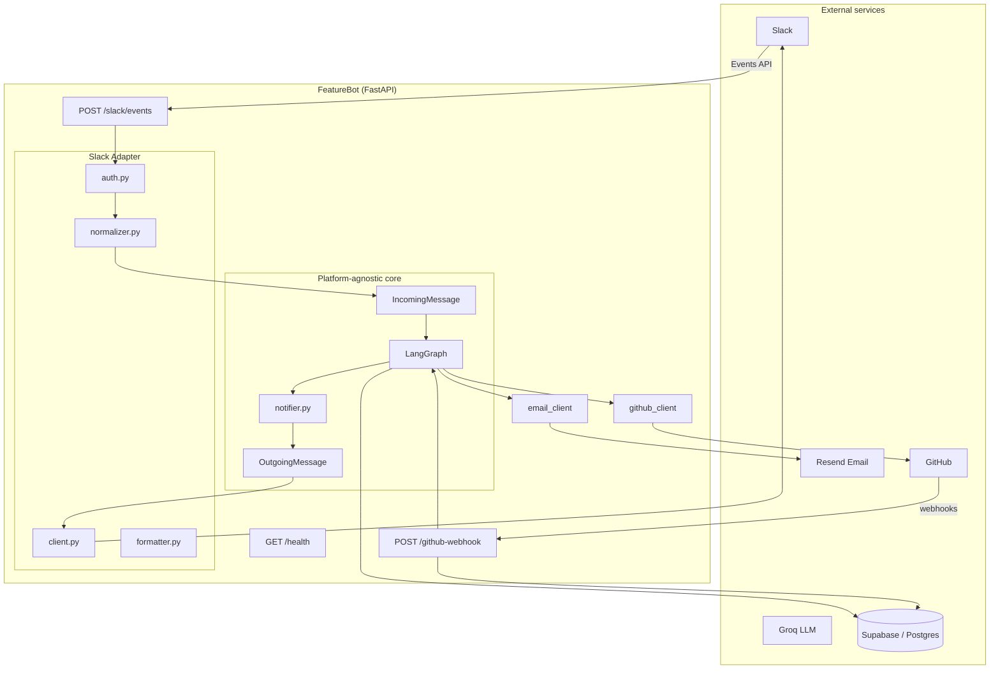
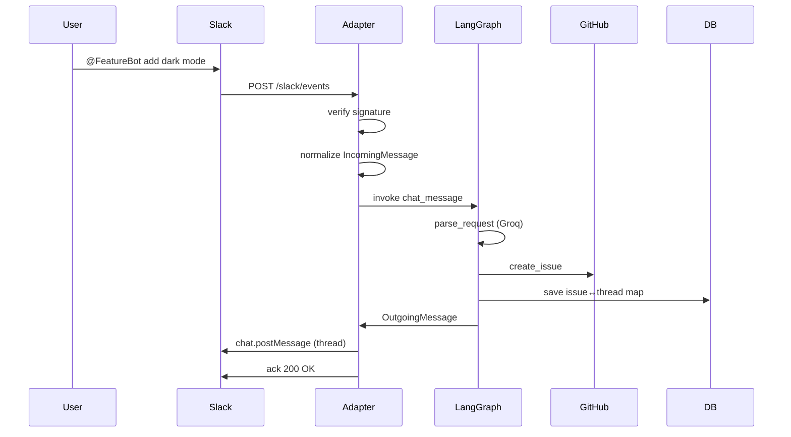

# FeatureBot

An enterprise AI assistant that receives feature requests from **Slack**, classifies them with **LangGraph + Groq**, creates **GitHub Issues**, tracks lifecycle events, and keeps the originating **Slack thread** synchronized — built with **FastAPI**, **LangGraph**, and a **platform-agnostic adapter architecture**.

> **Setup:** See **[SETUP.md](SETUP.md)** for Slack app configuration, credentials, and Cloud Run deployment.

---

## Architecture

Slack is only the communication layer. LangGraph never imports Slack SDK code.



### Sequence: feature request



---

## Project structure

```
app/
├── adapters/
│   ├── interfaces.py      # ChatPlatform, IncomingMessage, OutgoingMessage
│   ├── registry.py        # DI for active platform
│   └── slack/
│       ├── auth.py        # Signature + replay protection
│       ├── client.py      # Slack Web API
│       ├── formatter.py   # OutgoingMessage → Slack payload
│       ├── normalizer.py  # Slack JSON → IncomingMessage
│       ├── oauth.py       # OAuth install flow
│       ├── platform.py    # ChatPlatform implementation
│       └── webhook.py     # POST /slack/events
├── clients/
│   ├── github_client.py
│   └── email_client.py
├── graph/                 # Unchanged business logic
│   ├── build_graph.py
│   ├── nodes.py
│   └── state.py
├── services/
│   ├── graph_runner.py
│   ├── message_handler.py
│   └── notifier.py        # Nodes call this — not Slack
├── config.py
├── db.py
└── main.py
```

---

## API endpoints

| Method | Path | Purpose |
|--------|------|---------|
| `POST` | `/slack/events` | Slack Events API (messages, app_mention) |
| `GET` | `/slack/oauth/install` | Start Slack OAuth install |
| `GET` | `/slack/oauth/callback` | OAuth callback — returns bot token |
| `POST` | `/github-webhook` | GitHub issue/comment/label webhooks |
| `GET` | `/health` | Health check |

---

## Environment variables

| Variable | Required | Description |
|----------|----------|-------------|
| `GROQ_API_KEY` | Yes | Groq API key |
| `GITHUB_TOKEN` | Yes | GitHub PAT with `repo` scope |
| `GITHUB_REPO` | No | Fallback repo; prefer `repo: owner/repo` in thread |
| `GITHUB_WEBHOOK_SECRET` | Prod | Webhook HMAC secret |
| `SLACK_BOT_TOKEN` | Yes | Bot token (`xoxb-…`) |
| `SLACK_SIGNING_SECRET` | Yes | Request signature verification |
| `SLACK_CLIENT_ID` | OAuth | For `/slack/oauth/install` |
| `SLACK_CLIENT_SECRET` | OAuth | OAuth client secret |
| `SLACK_REDIRECT_URI` | OAuth | e.g. `https://<host>/slack/oauth/callback` |
| `SLACK_APP_TOKEN` | No | Socket Mode (not used) |
| `RESEND_API_KEY` | Yes | Email notifications |
| `EMAIL_FROM` | Yes | Verified sender domain |
| `DATABASE_URL` | Prod | Supabase/Postgres connection string |

Validate: `python scripts/check_env.py`

---

## Local setup

**Requires Python 3.11.**

```bash
python3.11 -m venv .venv
source .venv/bin/activate
pip install -r requirements.txt
cp .env.example .env
# fill in .env
uvicorn app.main:app --reload --port 8000
```

Tunnel for Slack webhooks: `ngrok http 8000`

---

## Slack app setup

1. Create app at [api.slack.com/apps](https://api.slack.com/apps) → **From scratch**.
2. **OAuth & Permissions** → Bot Token Scopes:
   - `app_mentions:read`, `chat:write`, `channels:history`, `groups:history`, `im:history`, `mpim:history`
3. **Event Subscriptions** → Enable → Request URL: `https://<public-url>/slack/events`
   - Subscribe to bot events: `app_mention`, `message.channels`, `message.groups`, `message.im`, `message.mpim`
4. **Basic Information** → copy **Signing Secret** → `SLACK_SIGNING_SECRET`
5. Install app to workspace → copy **Bot User OAuth Token** → `SLACK_BOT_TOKEN`
6. Invite bot to a channel: `/invite @FeatureBot`

### OAuth (optional)

Visit `https://<public-url>/slack/oauth/install` or configure `SLACK_CLIENT_ID`, `SLACK_CLIENT_SECRET`, `SLACK_REDIRECT_URI`.

---

## GitHub webhook

Repo → **Settings → Webhooks**:

- URL: `https://<public-url>/github-webhook`
- Secret: `GITHUB_WEBHOOK_SECRET`
- Events: **Issues**, **Issue comments**

---

## Usage in Slack

```
@FeatureBot repo: Prateek-Gaurav7296/feature-chatbot
@FeatureBot add a dark mode toggle to settings
```

When an issue is assigned, reply in the thread with the assignee's email.

---

## Deploy to Cloud Run

```bash
gcloud run deploy featurebot \
  --source . \
  --region us-central1 \
  --allow-unauthenticated \
  --set-env-vars SLACK_BOT_TOKEN=...,SLACK_SIGNING_SECRET=...,GROQ_API_KEY=...,GITHUB_TOKEN=...,GITHUB_WEBHOOK_SECRET=...,RESEND_API_KEY=...,EMAIL_FROM=...,DATABASE_URL=...
```

Update Slack Event Subscriptions URL and GitHub webhook to the Cloud Run URL.

### Supabase

Set `DATABASE_URL` to your Supabase Postgres URI. Run [`supabase/schema.sql`](supabase/schema.sql) in the SQL Editor. LangGraph checkpoint tables are auto-created on first start.

---

## Migration from Google Chat

See **[MIGRATION.md](MIGRATION.md)** for details on the adapter pivot.

---

## Extending to other platforms

Implement `ChatPlatform` in `app/adapters/<platform>/` and register via `set_chat_platform()`. LangGraph nodes and GitHub workflows remain unchanged.
