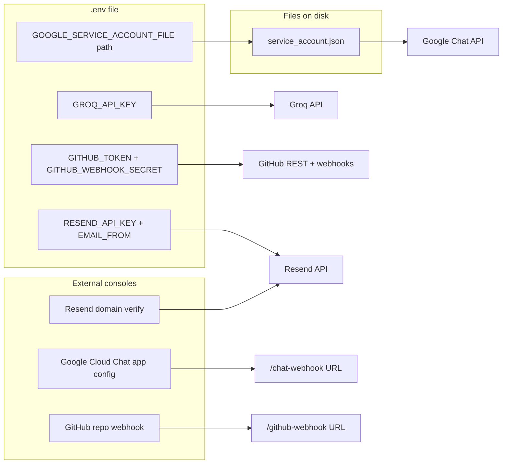

# FeatureBot credentials and setup guide

FeatureBot reads secrets from [`.env`](.env) (loaded by [`app/config.py`](app/config.py)). Some integrations also require **console configuration outside `.env`** (webhook URLs, GCP Chat app, Resend domain verification).



Run `python scripts/check_env.py` anytime to see which credentials are configured and which are still missing.

---

## What to put in `.env`

Copy [`.env.example`](.env.example) to `.env` and fill in:

| Variable | Required? | Used by | What to set |
|----------|-----------|---------|-------------|
| `GROQ_API_KEY` | **Yes** | [`app/graph/nodes.py`](app/graph/nodes.py) — parses chat text into issue JSON | API key from [console.groq.com](https://console.groq.com) (free tier, no card) |
| `GITHUB_TOKEN` | **Yes** | [`app/clients/github_client.py`](app/clients/github_client.py) — create issues, read comments | Classic Personal Access Token from [github.com/settings/tokens](https://github.com/settings/tokens) with **`repo`** scope |
| `GITHUB_REPO` | No | Same client | Fallback default repo (`owner/repo`) for threads that haven't linked one yet. Each Chat thread can instead be pointed at its own repo at runtime — see [Linking a thread to a repo](#linking-a-thread-to-a-repo) below — so this can be left blank |
| `GITHUB_WEBHOOK_SECRET` | **Yes for prod** | [`app/main.py`](app/main.py) — HMAC signature check on `/github-webhook` | Any random string you invent; must match the secret you enter when creating the GitHub webhook. If empty, verification is **skipped** (dev only) |
| `GOOGLE_SERVICE_ACCOUNT_FILE` | **Yes** | [`app/clients/chat_client.py`](app/clients/chat_client.py) — post messages to Chat | Path to JSON key file, default `./service_account.json` |
| `GOOGLE_CHAT_VERIFICATION_TOKEN` | **Yes for prod** | [`app/main.py`](app/main.py) — validates incoming Chat requests | Verification token from Google Chat API → Configuration. If empty, verification is **skipped** (dev only) |
| `RESEND_API_KEY` | **Yes** | [`app/clients/email_client.py`](app/clients/email_client.py) | API key from [resend.com](https://resend.com) dashboard |
| `EMAIL_FROM` | **Yes** | Same | Sender address, e.g. `bot@yourdomain.com` — must be a **verified domain** in Resend |
| `DATABASE_URL` | No (local) | Not wired yet for graph; SQLite used directly | Keep default for local dev. Only needed when you migrate to Postgres for Cloud Run |
| `OPENAI_API_KEY` | No | **Not used** in current code | Safe to leave blank |

---

## 1. Groq (LLM) — parse feature requests

**Purpose:** Turn informal chat text into structured GitHub issue JSON (title, body, labels).

**Steps:**
1. Sign up at [console.groq.com](https://console.groq.com).
2. Create an API key.
3. Set in `.env`:
   ```
   GROQ_API_KEY=gsk_...
   ```

**Model used:** `llama-3.3-70b-versatile` (hardcoded in [`nodes.py`](app/graph/nodes.py)).

---

## 2. GitHub — create issues + receive webhooks

**Purpose:** Create issues from parsed requests; receive assignment, comment, and close events.

### A. Personal Access Token (`GITHUB_TOKEN`)

1. Go to **GitHub → Settings → Developer settings → Personal access tokens → Tokens (classic)**.
2. Generate token with scope: **`repo`** (full control of private repositories). Since a single token now needs to reach every repo you link to threads, either grant it access to all of them or use a fine-grained PAT scoped to that set of repos.
3. Set in `.env`:
   ```
   GITHUB_TOKEN=ghp_...
   ```

The token owner must have permission to create issues and read comments in every repo you link. Labels used by the bot (`feature`, `bug`, `chore`, `ui`, `backend`, `urgent`) must exist in each repo or GitHub will reject issue creation there.

### A.1 Linking a thread to a repo (no `.env` edit needed)

Instead of a single `GITHUB_REPO` for the whole bot, each Google Chat thread can be pointed at its own repo at runtime. In the thread, message the bot with just the repo — no other text:

```
@FeatureBot repo: owner/repo
@FeatureBot set repo https://github.com/owner/repo
@FeatureBot https://github.com/owner/repo
```

The bot replies confirming the link and saves `thread_id → repo` in `featurebot_map.db` (see [`app/db.py`](app/db.py)). Every feature request in that thread afterward creates issues in that repo; GitHub webhook replies (assignment, comments, close) are routed back using the repo GitHub includes in the webhook payload, so multiple repos can be linked to different threads on the same running bot. `GITHUB_REPO` in `.env` is only used as a fallback for threads that haven't linked a repo yet — if it's blank and a thread hasn't linked one, the bot asks the user to link one before creating an issue.

### B. Webhook secret + registration (`GITHUB_WEBHOOK_SECRET`)

This is **not** an API key from GitHub — you choose the secret yourself.

1. Generate a random string:
   ```bash
   openssl rand -hex 32
   ```
2. Set in `.env`:
   ```
   GITHUB_WEBHOOK_SECRET=your-random-secret
   ```
3. In **every repo you plan to link to a thread**: **Settings → Webhooks → Add webhook**
   - **Payload URL:** `https://<your-public-url>/github-webhook`
   - **Content type:** `application/json`
   - **Secret:** same value as `GITHUB_WEBHOOK_SECRET` — use the same secret across all repos, since one running bot verifies all incoming webhooks with this one value
   - **Events:** Issues + Issue comments

For local dev, expose port 8000 with ngrok (`ngrok http 8000`) and use the ngrok HTTPS URL.

---

## 3. Google Chat — receive messages + post replies

**Purpose:** Users @-mention the bot in Chat; bot posts status updates back.

Google Chat does **not** use a simple API key in `.env`. It uses a **service account JSON file** plus **GCP console app configuration**.

### A. Service account JSON (`GOOGLE_SERVICE_ACCOUNT_FILE`)

1. Go to [console.cloud.google.com](https://console.cloud.google.com).
2. Create or select a project.
3. Enable **Google Chat API**.
4. **IAM & Admin → Service Accounts → Create service account** (any name).
5. **Keys → Add key → Create new key → JSON** — download the file.
6. Save as `service_account.json` in the project root (or another path).
7. Set in `.env`:
   ```
   GOOGLE_SERVICE_ACCOUNT_FILE=./service_account.json
   ```

`service_account.json` is listed in [`.gitignore`](.gitignore) — never commit it.

The client requests scope `https://www.googleapis.com/auth/chat.bot` ([`chat_client.py`](app/clients/chat_client.py)).

### B. Verification token (`GOOGLE_CHAT_VERIFICATION_TOKEN`)

1. In GCP: **APIs & Services → Google Chat API → Configuration**.
2. Copy the **Verification token** shown in the Chat app settings.
3. Set in `.env`:
   ```
   GOOGLE_CHAT_VERIFICATION_TOKEN=your-token-from-gcp
   ```

Incoming requests to `/chat-webhook` are validated against this token (Bearer header). Leave blank for local dev only.

### C. Register the Chat app (GCP console — not in `.env`)

1. In the same Chat API Configuration page, create/configure a Chat app:
   - **App name:** FeatureBot
   - **Interactive features:** On
   - **Functionality:** Receive 1:1 and group messages
   - **Connection settings:** **HTTP endpoint URL** (not Apps Script)
   - **App URL:** `https://<your-public-url>/chat-webhook`
2. Save and add the bot to a Google Chat space for testing.

Incoming messages hit [`POST /chat-webhook`](app/main.py). Outgoing messages use the service account via Chat API.

---

## 4. Resend (email) — notify assignees

**Purpose:** Send email when someone replies in Chat with the assignee's email address.

**Steps:**
1. Sign up at [resend.com](https://resend.com).
2. **Domains → Add domain** and complete DNS verification (SPF/DKIM).
3. Create an API key in the dashboard.
4. Set in `.env`:
   ```
   RESEND_API_KEY=re_...
   EMAIL_FROM=bot@yourdomain.com
   ```

`EMAIL_FROM` must use your verified domain. Resend's sandbox only sends to your own email until a domain is verified.

---

## 5. Public URL (not a key, but required)

Both Google Chat and GitHub webhooks need a **public HTTPS URL** pointing at your running app:

| Endpoint | Used by |
|----------|---------|
| `/chat-webhook` | Google Chat app |
| `/github-webhook` | GitHub webhook |
| `/health` | Health check |

### Local development

Create the virtualenv with **Python 3.11** (not 3.14 — dependencies won't install):

```bash
python3.11 -m venv .venv
source .venv/bin/activate
pip install -r requirements.txt
```

Then run the server:

```bash
source .venv/bin/activate
uvicorn app.main:app --reload --port 8000
```

In a second terminal:

```bash
ngrok http 8000
```

Use the ngrok HTTPS URL (e.g. `https://abc123.ngrok-free.app`) as the base for both webhook registrations:

- Google Chat App URL: `https://abc123.ngrok-free.app/chat-webhook`
- GitHub webhook Payload URL: `https://abc123.ngrok-free.app/github-webhook`

### Production

Deploy to Cloud Run (see [README.md](README.md)) and use the stable service URL in both consoles.

---

## Recommended setup order

1. Copy `.env.example` → `.env`
2. **Groq** — quickest to test LLM parsing
3. **GitHub token** — test issue creation (no `GITHUB_REPO` needed if you'll link repos per-thread)
4. **Resend** — verify domain early (DNS can take time)
5. **Google Chat** — service account + Chat app config (most steps)
6. Start server + ngrok
7. Point Chat App URL and GitHub webhook(s) at your public URL
8. Add bot to a Chat space and link a repo: `@FeatureBot repo: owner/repo`
9. Then send: `@FeatureBot add dark mode to settings`

---

## Quick verification checklist

| Integration | How to verify it works |
|-------------|------------------------|
| Groq | Chat message triggers graph; terminal shows LLM parse; issue gets a structured title/body |
| GitHub token | Issue appears in the repo linked to that thread (or `GITHUB_REPO`) after chat message |
| GitHub webhook | Assign issue on GitHub → bot asks for email in Chat |
| Google Chat (outbound) | After issue created, bot posts link in Chat (uses service account) |
| Google Chat (inbound) | @-mention reaches `/chat-webhook` (requires App URL + bot in space) |
| Resend | Reply with email in Chat → assignee receives email |

Validate your `.env` at any time:

```bash
python scripts/check_env.py
```
